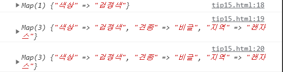
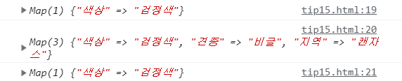

TIP15. 맵 생성 시 부수 효과를 피하라
=========

- 맵은 객체와 다르게 키-값 쌍을 자주 변경하는 경우에 적합하도록 설계됨
- 앞의 팁에서는 맵의 단일 인스턴스를 다뤘고 직접 데이터를 추가하거나 삭제 했음
<br>-> 맵의 사본을 생성함으로써 부수 효과(새로운 값으로 업데이트 할 때 발생 하는 것)를 피할 수 있음

```javascript
has()메서드

let myMap = new Map()
    .set('bar', "foo")

myMap.has('bar')   // returns true
myMap.has('baz')   // returns false
```


### 예제

- 사용자가 설정하지 않은 조건에 대해서는 기본값 적용, 추가 설정값은 기본값을 덮어 씀
- has() 메서드를 이용해 키가 있는지 확인하고 없으면 키-값을 설정
```javascript
const defaults = new Map()
    .set('색상', '갈색')
    .set('견종', '비글')
    .set('지역', '캔자스');

const filters=new Map()
    .set('색상', '검정색');

function applyDefaults(map, defaults){
    for (const [key, value] of defaults){
        if(!map.has(key)){
            map.set(key,value);
        }
    }
    return map;
}
console.log(filters);
console.log(applyDefaults(filters, defaults))
console.log(filters);
```


<br>
<br>

- 맵의 사본을 만듦으로써 원본의 수정을 피할 수 있다.
```javascript
const defaults = new Map()
    .set('색상', '갈색')
    .set('견종', '비글')
    .set('지역', '캔자스');

const filters=new Map()
    .set('색상', '검정색');

function applyDefaults(map, defaults){
    const copy = new Map([...map]);
    for (const [key, value] of defaults){
        if(!copy.has(key)){
            copy.set(key,value);
        }
    }
    return copy;
}
console.log(filters);
console.log(applyDefaults(filters, defaults))
console.log(filters);
```


<br>
<br>

- 위의 예제는 여러 가지 키의 존재 여부를 일일이 확인(생략이 가능하다)
- 맵은 객체와 마찬가지로 하나의 키를 한 번만 사용 가능
<br>-> 새로운 키로 맵을 생성하면 해당 키에 마지막으로 선언한 값을 사용
<br>-> 값을 설정하는 대신 갱신

```javascript
const filters = new Map()
    .set('색상', '검정색')
    .set('색상', '갈색');
filters.get('색상');
//갈색
```

- 맵의 특징과 객체 펼침 연산자를 이용하면 맵 병합하는 코드를 한 줄로 작성 가능
```javascript
let dog=new Map()
    .set('색상', '검정색')
    .set('종', '시바견')
    .set('지역', '서울');

let modify=new Map()
    .set('지역', '진주');

let modify2=new Map()
    .set('나이', 6);

let update= new Map([...dog, ...modify,...modify2]);

console.log(update);
```


<br>
<br>

- 함수를 개선
```javascript
function applyDefaults(map, defaults){
    return new Map([...defaults, ...map]);
}
```